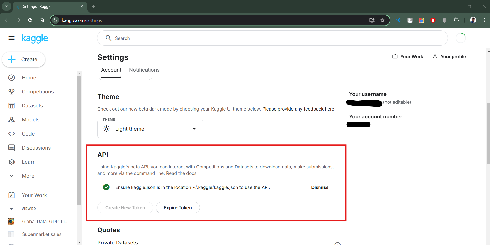
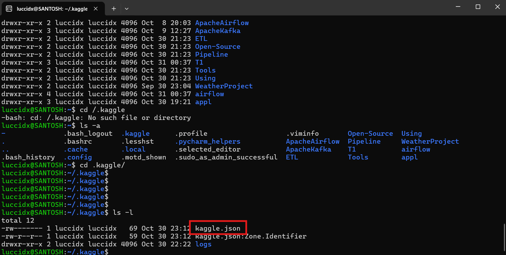
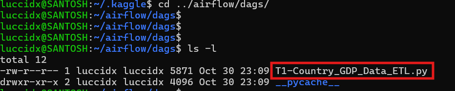
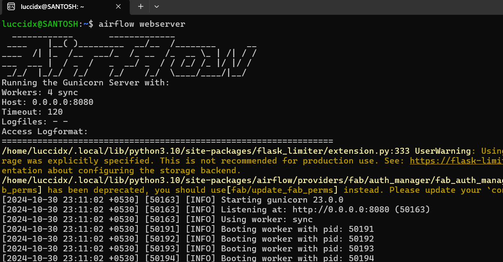
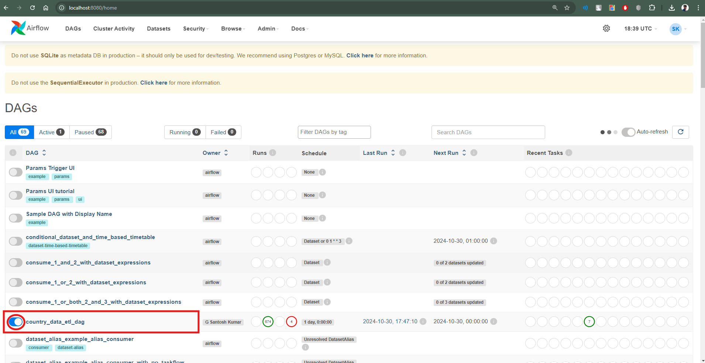
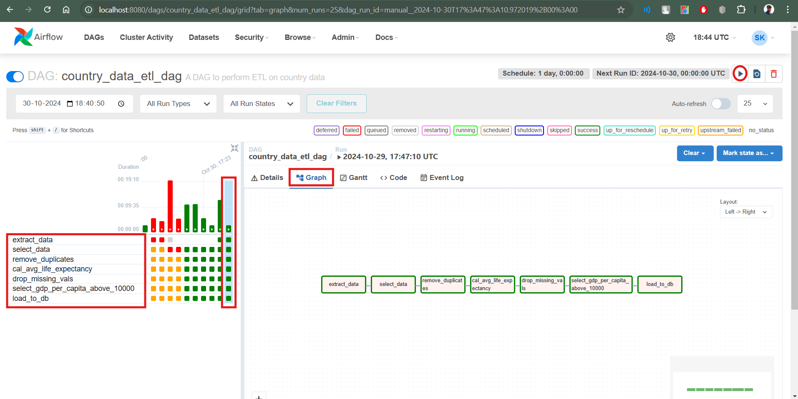
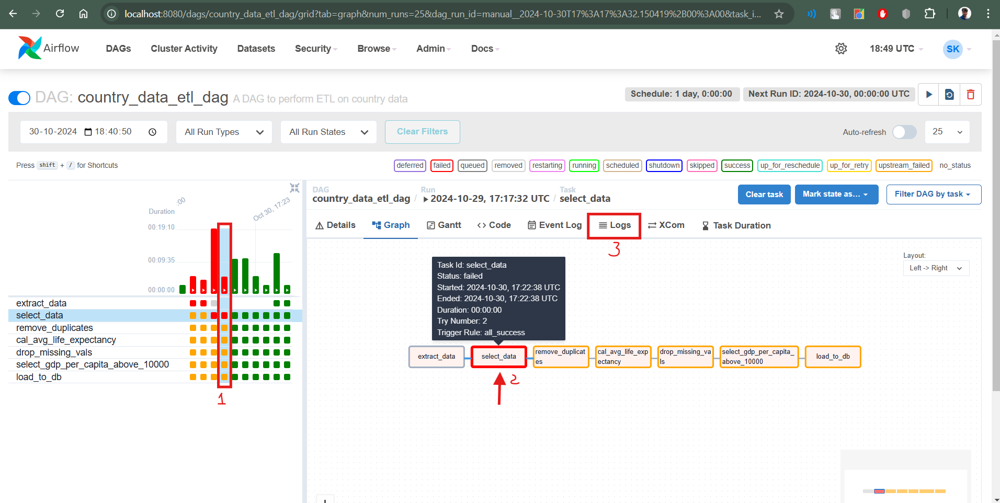
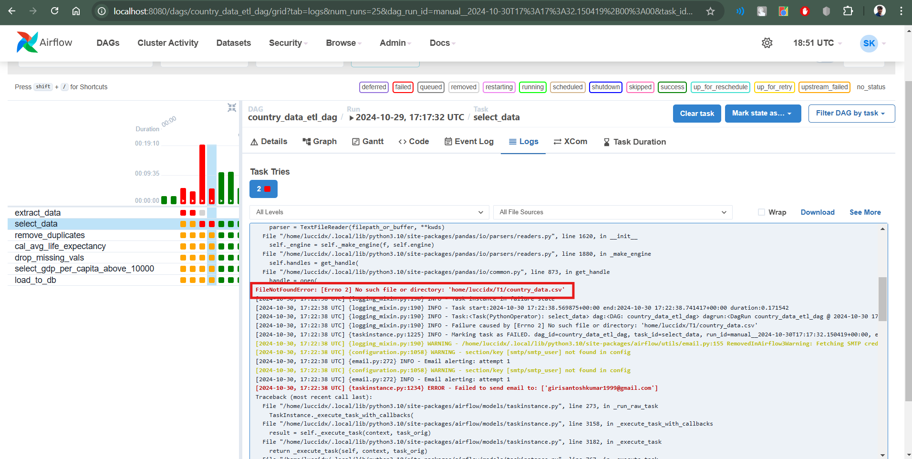
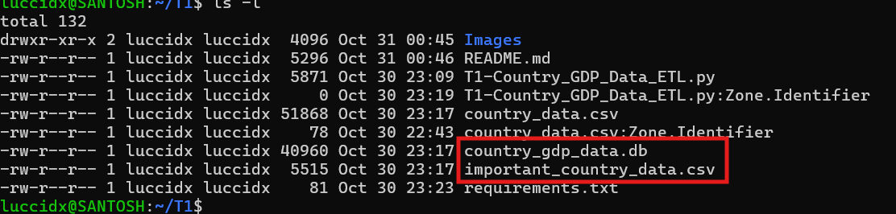
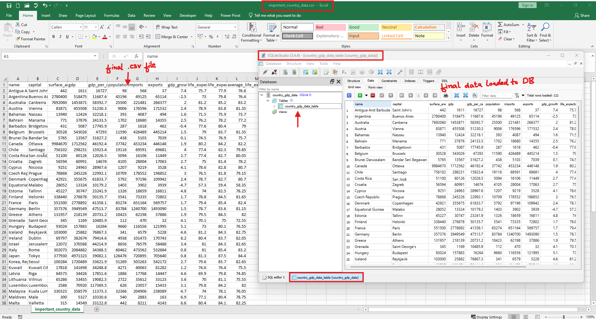

<h1>CLOUD AMBASSADORS - DATA ENGINEER - TAKE HOME ASSESSMENT</h1>


## **Task 1: ETL Pipeline Using Open-Source Tools**

### Table of Contents
- [Task Objective](#task-objective)
- [Project Overview](#project-overview)
- [Installation and Setup](#installation-and-setup)
  - [clone the repository](#1-clone-the-repository)
  - [Understand Project Structure](#2-understand-project-structure)
  - [Install Required Libraries](#3-install-required-libraries)
  - [Setup and configure Apache Airflow](#4-setup-and-configure-apache-airflow)
  - [Configure Kaggle Authentication](#5-configure-kaggle-authentication)
  - [Move the ETL Dag file to dags folder](#6-move-the-etl-dag-file-to-dags-folder)
  - [Start Apache webserver service](#7-start-apache-webserver-service)
  - [Unpause Dag](#8-unpause-dag)
  - [Trigger Dag](#9-trigger-dag)
  - [check for final data as a new csv file and loaded in a database table](#10-check-for-final-data-as-a-new-csv-file-and-loaded-in-a-database-table)
- [Understanding the ETL Script](#understanding-the-etl-script)
  - [Overview](#overview)
  - [Dag Arguments:](#1-dag-arguments)
  - [Dag Definition:](#2-dag-definition)
  - [Task Functions:](#3-task-functions)
  - [Define all the DAG tasks](#4-define-all-the-dag-tasks)
  - [Create the pipeline](#5-create-the-pipeline)
- [Author](#author)


### **Task Objective:** To Build a simple ETL (Extract, Transform, Load) pipeline using open-source tools.<br>

- **Extract**: Choose a CSV file as your source dataset. You may either provide a dataset
from a public source (e.g., Kaggle, data.gov) or use the sample dataset provided in
the instructions. Clearly mention where the dataset comes from in your
documentation.
- **Transform**: Perform a transformation on the dataset. This transformation could
include:
  - Filtering rows based on a condition.
  - Aggregating data (e.g., sum or average of a column).
  - Removing missing or invalid data.
- **Load**: Load: Load the transformed data into a new CSV file or into a local SQLite database.<br>
If using SQLite, include SQL queries to create the necessary tables and insert the
transformed data.
- **Automation**: You may automate the pipeline using a script (e.g., Python), or use a
tool like Apache Airflow, Luigi, or even a simple cron job to schedule the pipeline.<br>

---

### **Project Overview**
- **Operating System:** Linux
- **Tools Used:** Python, Pandas, SQLite, Apache Airflow
- **Dataset:** [Kaggle - Global Data: GDP, Life Expectancy & More](https://www.kaggle.com/datasets/arslaan5/global-data-gdp-life-expectancy-and-more/code)
- **Files:** `country_data.csv`: Source dataset from Kaggle.

---

### Installation and Setup

- Since we are using Apache Airflow as Workflow Management tool to schedule and automate the tasks, we will require install the project in a linux distribution. <br>
- for `Windows` 🪟 users, you can use `WSL` to download or clone the project.
- steps to install `WSL` can be found [here](https://docs.microsoft.com/en-us/windows/wsl/install)

#### **1. clone the repository**

- Open the terminal in WSL and run the following commands to clone the repository and install the required libraries.
- The following commands will install `git` and `python3-pip` if not already installed.
- The project will be cloned to the `T1` folder in the home directory, you can create foldername as per your choice.

```bash
sudo apt install git
sudo apt install python3-pip

mkdir T1
cd T1

git clone https://github.com/luccidx/CA-DE-T1-ETL
```
#### **2. Understand Project Structure**
- The project structure is as follows:
    
    ``` 
        ├── README.md
        ├── country_data.csv
        ├── country_gdp_data.db
        ├── important_country_data.csv
        ├── requirements.txt
        ├── Playground.ipynb
        ├── T1-Country_GDP_Data_ETL.py
    ```

#### **3. Install Required Libraries**
- The project requires the following libraries to be installed.
  - `airflow`
  - `datetime`
  - `pandas`
  - `kaggle`
  - `db-sqlite3`
  - `sqlite-database`
  - `pysqlite3`
- The libraries are mentioned in the `requirements.txt` file.
- The libraries can be installed using the following command.


```bash
pip3 install -r requirements.txt
```
- Post installation, a folder called `airflow` shall be created at automatically at path : *`home/user/`* 
- This folder shall contain all the necessary files and folders required for Apache Airflow to run.


#### **4. Setup and configure Apache Airflow**

- Create $AIRFLOW_HOME variable
  - The `AIRFLOW_HOME` variable is used to set the path where the Apache Airflow files are stored.
  - The `AIRFLOW_HOME` variable is set to `~/airflow` in the following command.
      ```bash
      export AIRFLOW_HOME=~/airflow
      ```
- Initialize Apache airflow database
  - The database is used to store the metadata of the tasks and the DAGs.
  - The database can be initialized using the following command.
      ```bash
      airflow db init 
      ```
- Create an Admin user
  - The admin user is responsible for managing the Apache Airflow UI.
  - The admin user can be created using the following command.
      ```bash
      airflow users create \
          --username admin \
          --firstname FIRST_NAME \
          --lastname LAST_NAME \
          --role Admin \
          --email MAIL_ID
    ```
- Start the scheduler
  - The scheduler is responsible for scheduling the tasks in the DAG.
  - The scheduler can be started using the following command.
      ```bash
      airflow scheduler
      ```

#### **5. Configure Kaggle Authentication**
- Open https://www.kaggle.com/
- Sign in or create an account
- Click on the profile icon on the top right corner
- Navigate to settings
- under API section click on `Create New Token`
- A `kaggle.json` authentication file shall be downloaded in download folder.

- place this file in `/home/user/.kaggle` folder via WSL


#### **6. Move the ETL Dag file to dags folder**
- [**IMP**]Before we copy the script please make sure to edit the default path in the script. In the script the default_path is `"/home/luccidx/T1/"`, change it to `"/home/user/<folder_name>/"`
- [**IMP**]This folder shall contain raw data and all the intermittent transformation files and final database file. 
- copy the python script file `T1-Country_GDP_Data_ETL.py` to following path `\home\user\airflow\dags`
- this will help airflow in identify the DAG declared in the script and instantiate it.
```bash
cp T1-Country_GDP_Data_ETL.py \home\user\airflow\dags
```



#### **7. Start Apache webserver service**
- Start the webserver service to view the Apache Airflow UI
- The webserver service can be started using the following command.
```bash
airflow webserver 
```



#### **8. Unpause Dag** 
- Navigate to default port http://localhost:8080/ over the web browser to open the Apache Airflow UI home page
- Search for the Dag - **"country_data_etl_dag"** and click on the toggle to unpause the dag 


#### **9. Trigger Dag**
- click on the Dag **"country_data_etl_dag"** to open the complete detailed page of the DAG. 
- click on the `play` button at the top right corner to trigger the Dag Manually.
- The DAG shall automatically trigger as per the scheduled time in the code
- click on the `graph` tab to view all the tasks involved in the ETL pipeline.
- on the left hand pane, we can see all the tasks status. hovering over each box gives more detailed information.


- If any task in `failed`,`upstream_failed` status or is in `up_for_retry` status, we can click on the particular task and click on the logs tab to view the detailed logs.

- Analyse the logs to find the issue



#### **10. check for final data saved as a new csv file and loaded in a database table**
- navigate to the default path `/home/user/T1` to find the updated data in the csv file and database



- open the csv file to view the final transformed data 
- open the database file in sqlstudio to view the transformed data


---

### **Understanding the ETL Script**

#### **Overview**
- The ETL python script consists of 7 main functions for 7 different tasks
    ```bash
  ├── extract_data()
  ├── select_data()
  ├── remove_duplicates()
  ├── cal_avg_life_expectancy()
  ├── drop_missing_vals()
  ├── select_gdp_per_capita_above_10000()
  ├── load_to_db()   
  
    ```
- Defining the DAG Argument and DAG Definition, defining the tasks, task pipeline

#### 1. Dag Arguments: 
- The default arguments for the DAG are defined as follows:
- The owner name, start date, email, retries, retry delay are defined in the default_args dictionary.
- The owner name is the name of the person who owns the DAG.
- The start date is the date from which the DAG should start running.
- The email is the email address of the owner.
- The retries is the number of retries the task should attempt in case of failure.
- The retry delay is the time interval between retries.

```python
default_args = {
    'owner': 'G Santosh Kumar',                         ## -- owner name
    'start_date': days_ago(0),                          ## -- present day
    'email': ['girisantoshkumar1999@gmail.com'],        ## -- owner mail ID
    'retries': 1,                                       ## -- number of retry 
    'retry_delay': timedelta(minutes=5),                ## -- retry frequency
}
```
#### 2. Dag Definition: 
- The DAG is defined with the following parameters:
- The name of the DAG is `country_data_etl_dag`.
- The default arguments are passed to the DAG.
- The description of the DAG is `A DAG to perform ETL on country data`.
- The schedule interval is set to run the DAG daily.
- The start date is set to 1st January 2024.

```python
dag = DAG(
    'country_data_etl_dag',                             ## -- Name of the DAG
    default_args=default_args,                          ## -- map default_args 
    description='A DAG to perform ETL on country data', ## -- DAG Definition
    schedule_interval=timedelta(days=1),                ## -- Schedule interval
    start_date=datetime(2024, 1, 1),                    ## -- start date for DAG
)
```

#### 3. Task Functions: 
- The following functions are defined for the tasks in the ETL pipeline.
- Each function performs a specific task in the ETL pipeline.
- The functions are defined as follows:
- `extract_data()` : extract the csv file from Kaggle and save it to default_path
```python
def extract_data():
    print("Extracting data from Kaggle")
    dataset = "arslaan5/global-data-gdp-life-expectancy-and-more"
    kaggle.api.dataset_download_files(dataset, path=default_path, unzip=True)
    print("Data extracted successfully")
```
- `select_data()` : select only the important necessary columns of our requirement and save it to a new csv file
```python
def select_data():
    print("Reading data from CSV file")
    data = pd.read_csv(default_path + "country_data.csv")
    print("Data read successfully")
    print("Selecting important columns")
    important_columns = ['name', 'capital', 'surface_area', 'gdp', 'gdp_per_capita', 'population', 'imports', 'exports',
                         'gdp_growth', 'life_expectancy_male', 'life_expectancy_female']
    important_data = data[important_columns]
    print("Important columns selected")
    print("Saving important data to CSV file")
    important_data.to_csv(default_path + "important_country_data.csv", index=False)
```
  - `remove_duplicates()` : the data contains few rows which are repeated/ duplicates, so lets remove those duplicates
```python
def remove_duplicates():
    print("Removing duplicates from data")
    data = pd.read_csv(default_path + "important_country_data.csv")
    data.drop_duplicates(inplace=True)
    print("Duplicates removed")
    print("Saving data to CSV file")
    data.to_csv(default_path + "important_country_data.csv", index=False)
```
- `cal_avg_life_expectancy()`: in data, we have seperate life_expectency_rate for male and female, so lets find the average life_expectency_rate irrespective of gender
```python
def cal_avg_life_expectancy():
    print("Calculating average life expectancy")
    data = pd.read_csv(default_path + "important_country_data.csv")
    data['average_life_expectancy'] = (data['life_expectancy_male'] + data['life_expectancy_female']) / 2
    print("Average life expectancy calculated")
    print("Saving data to CSV file")
    data.to_csv(default_path + "important_country_data.csv", index=False)
```
- `drop_missing_vals()`: some columns have `NaN` or `Null` values, which are usually defect data for future analysis purpose, so lets drop those rows where such values are present
```python
def drop_missing_vals():
    print("Dropping rows with missing values")
    data = pd.read_csv(default_path + "important_country_data.csv")
    data.dropna(inplace=True)
    print("Rows with missing values dropped")
    print("Saving data to CSV file")
    data.to_csv(default_path + "important_country_data.csv", index=False)
```
- `select_gdp_per_capita_above_10000()` - for simplicity, we are currently only interested in data of countries whose GDP per capita is above 10K, so lets filter out the data
```python
def select_gdp_per_capita_above_10000():
    print("Selecting countries with GDP per capita above 10000")
    data = pd.read_csv(default_path + "important_country_data.csv")
    data = data[data['gdp_per_capita'] > 10000]
    print("Countries with GDP per capita above 10000 selected")
    print("Saving data to CSV file")
    data.to_csv(default_path + "important_country_data.csv", index=False)
```
- `load_to_db()`: finally we shall load the resulting required transformed and filtered data into a `.csv` file and also load to a table in database using `SQLite3`.
```python
def load_to_db():
    print("Loading data to SQLite database")
    data = pd.read_csv(default_path + "important_country_data.csv")
    conn = sqlite3.connect(default_path + "country_gdp_data.db")
    cursor = conn.cursor()
    create_table = """
                CREATE TABLE IF NOT EXISTS country_gdp_data_table (
                    name TEXT, 
                    capital TEXT, 
                    surface_area REAL, 
                    gdp REAL, 
                    gdp_per_capita REAL,
                    population REAL, 
                    imports REAL, 
                    exports REAL, 
                    gdp_growth REAL, 
                    life_expectancy_male REAL,
                    life_expectancy_female REAL, 
                    average_life_expectancy REAL
                )
            """
    cursor.execute(create_table)

    for row in data.itertuples(index=False):
        cursor.execute("""
                    INSERT INTO country_gdp_data_table 
                    (name, capital, surface_area, gdp, gdp_per_capita, population, imports, exports, gdp_growth, life_expectancy_male, life_expectancy_female, average_life_expectancy) 
                    VALUES (?, ?, ?, ?, ?, ?, ?, ?, ?, ?, ?, ?)
                """, (
        row.name, row.capital, row.surface_area, row.gdp, row.gdp_per_capita, row.population, row.imports, row.exports,
        row.gdp_growth, row.life_expectancy_male, row.life_expectancy_female, row.average_life_expectancy))

    conn.commit()
    conn.close()
```

#### 4. Define all the DAG tasks 
- The following tasks are defined in the DAG.
- Each task is defined as a PythonOperator.
- The task_id is the unique identifier for the task.
- The python_callable is the function that should be called by the task.
- The dag is the DAG to which the task should be added.

```python 
extract_data_task = PythonOperator(
    task_id='extract_data',
    python_callable=extract_data,
    dag=dag,
)

select_data_task = PythonOperator(
    task_id='select_data',
    python_callable=select_data,
    dag=dag,
)

remove_duplicates_task = PythonOperator(
    task_id='remove_duplicates',
    python_callable=remove_duplicates,
    dag=dag,
)

cal_avg_life_expectancy_task = PythonOperator(
    task_id='cal_avg_life_expectancy',
    python_callable=cal_avg_life_expectancy,
    dag=dag,
)

drop_missing_vals_task = PythonOperator(
    task_id='drop_missing_vals',
    python_callable=drop_missing_vals,
    dag=dag,
)

select_gdp_per_capita_above_10000_task = PythonOperator(
    task_id='select_gdp_per_capita_above_10000',
    python_callable=select_gdp_per_capita_above_10000,
    dag=dag,
)

load_to_db_task = PythonOperator(
    task_id='load_to_db',
    python_callable=load_to_db,
    dag=dag,
)
```

#### 5. Create the pipeline
- The pipeline is created by defining the sequence of tasks.
- The sequence of tasks is defined using the `>>` operator.

```python
extract_data_task >> select_data_task >> remove_duplicates_task >> cal_avg_life_expectancy_task >> drop_missing_vals_task >> select_gdp_per_capita_above_10000_task >> load_to_db_task
```

---

### **Author**
- **G Santosh Kumar**
- **Email:** `girisantoshkumar1999@gmail.com`
- **GitHub:** [luccidx](https://github.com/luccidx)

- **Socials:**
[](https://linkedin.com/in/g-santosh-kumar) 
[](https://facebook.com/santosh.roxstar34) 
[](https://instagram.com/https://instagram.com/luccidx)
[](https://medium.com/@girisantoshkumar1999) 
[](https://x.com/g_santoshkumar1) 
[](https://youtube.com/@girisantoshkumar) 

---
### **References**
- [Apache Airflow Documentation](https://airflow.apache.org/docs/apache-airflow/stable/index.html)
- [Download Kaggle Dataset](https://stackoverflow.com/questions/49386920/download-kaggle-dataset-by-using-python)
- [Pandas Documentation](https://pandas.pydata.org/docs/)
- [Pandas Dataframe](https://www.geeksforgeeks.org/python-pandas-dataframe/)
- [Using pandas to connect to sqlite3 -1](https://datatofish.com/create-database-python-using-sqlite3/)
- [Using pandas to connect to sqlite3 -2](https://www.dataquest.io/blog/python-pandas-databases/)
- [Using Pandas with SQL knowledge](https://pandas.pydata.org/docs/getting_started/comparison/comparison_with_sql.html#)
